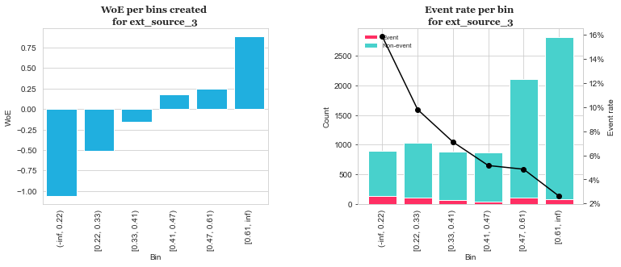

===========
ml_processor
===========

**ml_processor** is a library written in python for perfoming most of the common data preprocessing tasks involved in building machine learning models. It includes methods for:

* perfroming necessary data transformation desired for machine learning modesl
* hyperparameter tunning using different methods notably One Hot encoding and WOE transformation
* automted machine learning model fitting and model performacne evaluation

.. list-table::

	* - .. figure:: images/output_24_0.png

.. list-table::

	* - .. figure:: images/output_56_0.png

.. contents:: **Table of Contents**

Installation
============

To install the latest release of ml_processor from PyPi:

.. code-block:: test
	
	pip install ml_processor

Depencies
---------

ml-processor requires

* pandas
* numpy
* matplotlib
* seaborn
* logging
* json
* dotenv
* sklearn
* optbinning
* pickle
* joblib
* snowflake
* sqlalchemy
* xgboost
* statsmodels
* hyperopt
* scipy

Getting started
===============

Tutorials
---------

Example: config
---------------

**config** from the configuration sub-module provides a conveneient way for working with information such as credentials that one might want to keep secret and not include into their script. It also provides an easy of logging information both to the console and creating of log files.

get_credentials
_______________

Takes as an argument a path to the location of a stored .env file and returns the contents in the file.

.. code-block:: python

   from ml_processor.configuration import config

   >>> config.get_credentials('./examples/.env')

   OrderedDict([('username', 'email.example.com'), ('password', 'myPassword')])

Example: eda_data_quality
-------------------------

Checks dataset aganist specific rules and assigns a data quality score. 

Let us load the `Home Credit Default Risk <https://www.kaggle.com/competitions/home-credit-default-risk/data?select=application_train.csv>`_ dataset provided on kaggle and perform qaulity checks on it

.. code-block:: python
   
   import pandas as pd

   df = pd.read_csv('./data/application_train.csv')

   >>> eda_data_quality(df).head()

.. code-block:: text
    
   2022-10-03 23:15:19,318:INFO:rule_1 : More than 50% of the data missing
   2022-10-03 23:15:19,319:INFO:rule_2 : Missing some data
   2022-10-03 23:15:19,319:INFO:rule_3 : 75% of the data is the same and equal to the minimum
   2022-10-03 23:15:19,319:INFO:rule_4 : 50% of the data is the same and equal to the minimum
   2022-10-03 23:15:19,320:INFO:rule_5 : Has negative values
   2022-10-03 23:15:19,320:INFO:rule_6 : Possible wrong data type
  
                                type  unique  missing pct.missing      mean  min  25%  50%     75%  max  rule_1  rule_2  rule_3  rule_4  rule_5  rule_6  quality_score
   elevators_mode            float64      26   163891       53.3%  0.074490  0.0  0.0  0.0  0.1208  1.0       1       1       0       1       0       1       0.400000
   nonlivingapartments_avg   float64     386   213514       69.4%  0.008809  0.0  0.0  0.0  0.0039  1.0       1       1       0       1       0       0       0.528571
   elevators_avg             float64     257   163891       53.3%  0.078942  0.0  0.0  0.0  0.1200  1.0       1       1       0       1       0       0       0.528571
   nonlivingapartments_mode  float64     167   213514       69.4%  0.008076  0.0  0.0  0.0  0.0039  1.0       1       1       0       1       0       0       0.528571
   elevators_medi            float64      46   163891       53.3%  0.078078  0.0  0.0  0.0  0.1200  1.0       1       1       0       1       0       0       0.528571

We pass ``data`` and generate the quality score for all the columns in the data.

Example: binary_eda_plot
------------------------

Visualizes the distribution of labels of a binary target variable within each attribute of the different characteristics (features). For categorical variables, each categorical level is an attribute while for numerical variables, the attributes are created by splitting the variable at different percentiles with each group having 10% of the total data. If the value is the same at different percentiles, on the maximum percentile is considered and all the values upto that percentile assigned the same attribute.

We again use the `Home Credit Default Risk <https://www.kaggle.com/competitions/home-credit-default-risk/data?select=application_train.csv>`_ dataset and plot a few columns. 

First we initiate the plots by passing the dataset. If we want to plot specific columns, we pass ``plot_columns``; a dict with variables grouped by their data types ``e.g {'target': [string name of target column], 'discrete' : [list of discrete columns], 'numeric': [list of numeric columns]}``. Incase of columns that should use logarithmic scale, we pass ``log_columns``; alist of columns to use logarithmic scale.

In this example, we simply pass the data and keep the default for the other parameters since we want to plot all columns and we don;t want to have any logarithmoc scales. We also use the default palette ``{1:'red', 0:'deepskyblue'}``; you can change to suit you need.

.. code-block:: python

   # initiate plots
   eda_plot = binary_eda_plot(df_plot)

   # generate plots
   >>> eda_plot.get_plots()

.. image:: images/output_24_0.png

After the plots ahve been initiated, we call the ``get_plots`` method to generate the plots.

Example: data_prep
------------------

``data_prep`` provides a conevient way for transforming data into formats that machine learning models can work with more easily

We initiate the data_prep by passing the data, features and the categories

.. code-block :: python
   
   # define the variables
   target = 'target'
   features = ['amt_income_total', 'name_contract_type','code_gender']
   categories = ['name_contract_type','code_gender']

   # initiate data transformation
   init_data = data_prep(data=df_transform, features=features, categories=categories)

Two types of transfromation are currently possible:

* One Hot Encoding - For some more details, Jason Brownlee covers  `Why One Hot Encode Data in Machine Learning <https://machinelearningmastery.com/why-one-hot-encode-data-in-machine-learning/>`_.

* Weight of Evidence (WoE) Transformation - Some futher details on the `The binning procedure <https://documentation.sas.com/doc/en/vdmmlcdc/8.1/casstat/viyastat_binning_details02.htm#:~:text=Weight%20of%20evidence%20(WOE)%20is,a%20nonevent%20or%20an%20event.>`_.

One Hot Encoding
________________

create_encoder
++++++++++++++

Create One Hot encoder. Running this method creates a sub-directory  ``data_prep`` within the cureent working working directory and saves the created encoder as a pickle file ``encoder``. The saved encoder can be then load as pickle file and used to transform data in othern enviroments like production

.. code-block:: python

   encoder = init_data.create_encoder()

oneHot_transform
++++++++++++++++

Calling  ``oneHot_transform`` transforms the data using the encoder created using ``create_encoder`` method. If the encoder has not yet been created, calling ``oneHot_transform`` triggers the creation and saving of the encoder first using the ``create_encoder``.

.. code-block:: python

   df_encode = init_data.oneHot_transform()
   >>> df_encode.head()

.. code-block:: python

      target  amt_income_total name_contract_type code_gender  name_contract_type_Revolving loans  code_gender_M
   0       0          315000.0         Cash loans           M                                 0.0            1.0
   1       0          382500.0         Cash loans           F                                 0.0            0.0
   2       0          450000.0         Cash loans           M                                 0.0            1.0
   3       0          135000.0         Cash loans           M                                 0.0            1.0
   4       0           67500.0         Cash loans           M                                 0.0            1.0

You can obtain the encoder using the ``encoder`` property.

.. code-block:: python

    >>> init_data.encoder

    OneHotEncoder(drop='if_binary', handle_unknown='ignore', sparse=False)

WoE transformation
__________________

The WoE transformation executes several methods from **optbinning** provided by Guillermo Navas-Palencia. Further details can be found on github `OptBinning <https://github.com/guillermo-navas-palencia/optbinning>`_.

woe_bins
++++++++

Generate binning process for woe transformation. The binning process created is saved as ``binningprocess.pkl`` in the sub-directory ``data_prep`` in the current working directory

.. code-block:: python
  
   init_data.woe_bins()

To get the created binning process created, use the property ``**binning_process**``

.. code-block:: python

   >>> init_data.binning_process

.. code-block:: text

   BinningProcess(categorical_variables=['name_contract_type', 'code_gender',
                                      'flag_own_car', 'flag_own_realty',
                                      'name_type_suite', 'name_income_type',
                                      'name_education_type',
                                      'name_family_status', 'name_housing_type',
                                      'occupation_type',
                                      'weekday_appr_process_start',
                                      'organization_type', 'fondkapremont_mode',
                                      'housetype_mode', 'wallsmaterial_mode',
                                      'emergencystate_mo...
                               'name_type_suite', 'name_income_type',
                               'name_education_type', 'name_family_status',
                               'name_housing_type',
                               'region_population_relative', 'days_birth',
                               'days_employed', 'days_registration',
                               'days_id_publish', 'own_car_age', 'flag_mobil',
                               'flag_emp_phone', 'flag_work_phone',
                               'flag_cont_mobile', 'flag_phone', 'flag_email',
                               'occupation_type', 'cnt_fam_members',
                               'region_rating_client', ...])

woe_bin_table
+++++++++++++

Shows the summary results of the created bins.

.. code-block:: python

   bin_table = init_data.woe_bin_table()
   >>> bin_table.head()

.. code-block:: text

                   name        dtype   status  selected n_bins        iv        js      gini quality_score
   0       ext_source_3    numerical  OPTIMAL      True      6  0.419161  0.050627  0.351672      0.214852
   1       ext_source_1    numerical  OPTIMAL      True      7  0.325791  0.039244  0.306015      0.185009
   2       ext_source_2    numerical  OPTIMAL      True      7  0.278363  0.033828  0.286398      0.157844
   3  organization_type  categorical  OPTIMAL      True      5  0.129885  0.015735  0.170484      0.280232
   4      days_employed    numerical  OPTIMAL      True      5   0.10551  0.013074  0.176601      0.203093

get_var_bins
+++++++++++

Shows the distribution of the classes within the bins created. We pass the variable whose bins we wish to see.

.. code-block:: python

   >>> init_data.get_var_bins('ext_source_3')

