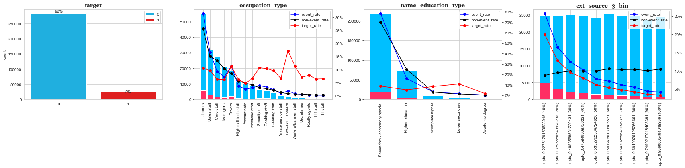
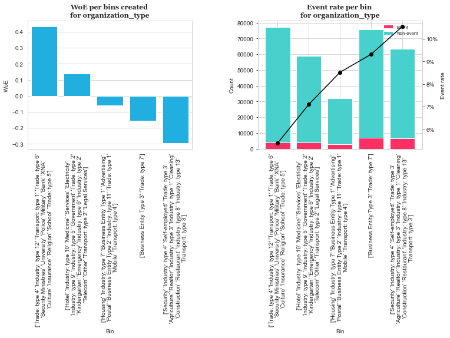
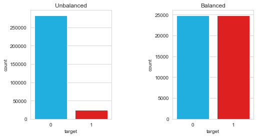
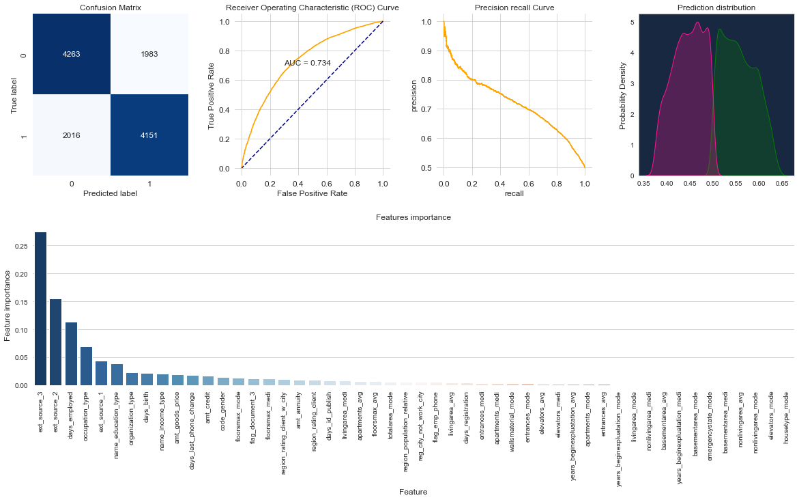

<!-- <p style=" border-top: 5px solid #21B6A8; 
        ">
    ml_processor package
</p> -->
<h1 style="text-align: left; background-color:  #21B6A8; font-size: 32px; font-weight:bold; padding: 10px; 
          font-family: Tahoma, sans-serif;">
    ml_processor package
</h1>

## Configuration


```python
from ml_processor.configuration import config
```


<div>
    <p style="background-color:  #D4F1F4; border-top: 5px solid #21B6A8; padding: 10px;">
        <span style="font-size: 16px; font-weight:bold"><b>config</b></span>
    </p>
    <p style="margin-left:25px">
        Perform basic configurations and logging
    </p>
    <p style="">
        <span style="margin-left:25px; background-color:#ECECEC; border-left: 2.5px solid #D4D4D4; 
                     padding: 5px">
            Parameters
        </span>
    </p>
    <p style="margin-left:25px">
        <ul style="margin-left:50px">
            <li>None</li>
        </ul>
    </p>
</div>


<div style="margin-left:25px;">
    <p style="">
        <span style="background-color:#ECECEC; border-left: 2.5px solid #D4D4D4; padding: 5px">
            <span style="font-size: 16px; font-weight:bold"><b>add_path</b></span> (lib_path=None)
        </span>
    </p>
    <p style="margin-left:25px">
        Add path to current home path
    </p>
    <p >
        <span style="margin-left:25px; background-color:#ECECEC; border-left: 2.5px solid #D4D4D4; padding: 5px">
            Parameters
        </span>
    </p>
    <p style="margin-left:25px">
        <ul style="margin-left:50px">
            <li><b>lib_path</b> (<i>string</i>) - Path to add to home path</li>
        </ul>
    </p>
</div>


<div style="margin-left:25px;">
    <p style="">
        <span style="background-color:#ECECEC; border-left: 2.5px solid #D4D4D4; padding: 5px">
            <span style="font-size: 16px; font-weight:bold"><b>get_credentials</b></span> (env_path=None)
        </span>
    </p>
    <p style="margin-left:25px">
        Get credentials stored in dot file
    </p>
    <p >
        <span style="margin-left:25px; background-color:#ECECEC; border-left: 2.5px solid #D4D4D4; padding: 5px">
            Parameters
        </span>
    </p>
    <p style="margin-left:25px">
        <ul style="margin-left:50px">
            <li><b>env_path</b> (string) - Path to dot file with credentials</li>
        </ul>
    </p>
    <p>
        <span style="margin-left:25px; background-color:#ECECEC; border-left: 2.5px solid #D4D4D4; padding: 5px">
            Returns 
        </span>
    </p>
    <p style="margin-left:50px; ">
        <b>dict</b> - Stored credentials 
    </p>
    <p >
        <span style="margin-left:25px; padding: 5px; font-weight: bold">
            Example
        </span>
    </p>
</div>


```python
env_path = './.env'
config.get_credentials(env_path)
```


    OrderedDict([('username', 'email.example.com'), ('password', 'myPassword')])


<div style="margin-left:25px;">
    <p style="">
        <span style="background-color:#ECECEC; border-left: 2.5px solid #D4D4D4; padding: 5px">
            <span style="font-size: 16px; font-weight:bold"><b>get_logger</b></span> (file=None)
        </span>
    </p>
    <p style="margin-left:25px">
        Create logging.getLogger() object
    </p>
    <p >
        <span style="margin-left:25px; background-color:#ECECEC; border-left: 2.5px solid #D4D4D4; padding: 5px">
            Parameters
        </span>
    </p>
    <p style="margin-left:25px">
        <ul style="margin-left:50px">
            <li><b>file</b> (<i>string (default=None)</i>) - File name to store log e.g modelLogs.log. If no file name is provided, logging is on done to the console while if the file name is provide, logging is done both to the console and file</li>
        </ul>
    </p>
    <p >
        <span style="margin-left:25px; background-color:#ECECEC; border-left: 2.5px solid #D4D4D4; padding: 5px">
            Returns 
        </span>
    </p>
    <p style="margin-left:50px; ">
        <b>object</b> - logging.getLogger 
    </p>
    <p >
        <span style="margin-left:25px; padding: 5px; font-weight: bold">
            Example
        </span>
    </p>
</div>


```python
logger = config.get_logger()
logger.info('Looking to console only. Provide file name to create log file')
```

    2022-09-30 17:20:15,143:INFO:Looking to console only. Provide file name to create log file


## snowflake_processor


```python
from ml_processor.etl_processor import snowflake_processor
```


<div >
    <p style="background-color:  #D4F1F4; border-top: 5px solid #21B6A8; padding: 10px;">
        <span style="font-size: 16px; font-weight:bold"><b>snowflake_processor</b></span>(username=None, password=None, account=None, warehouse=None, database=None)
    </p>
    <p style="margin-left:25px">
        Performing ETL tasks such as connecting to snowflake and retrieving data from snowflake.
    </p>
    <p style="">
        <span style="margin-left:25px; background-color:#ECECEC; border-left: 2.5px solid #D4D4D4; 
                     padding: 5px">
            Parameters
        </span>
    </p>
    <p style="margin-left:25px">
        <ul style="margin-left:50px">
            <li><b>username</b> (<i>string (default=None)</i>) - Username for connecting to snowflake.</li><br>
            <li><b>password</b> (<i>string (default=None)</i>) - Password for connecting to snowflake.</li><br>
            <li><b>account</b> (<i>string (default=None) </i>) - Snowflake account.</li><br>
            <li><b>warehouse</b> (<i>string (default=None)</i>) - Warehouse name.</li><br>
            <li><b>database</b> (<i>string (default=None)</i>) - Database name.</li><br>
        </ul>
    </p>
</div>


<div style="margin-left:25px;">
    <p style="">
        <span style="background-color:#ECECEC; border-left: 2.5px solid #D4D4D4; padding: 5px">
            <span style="font-size: 16px; font-weight:bold"><b>connect</b></span> ( )
        </span>
    </p>
    <p style="margin-left:25px">
        Create connection to snowflake.
    </p>
    <p >
        <span style="margin-left:25px; background-color:#ECECEC; border-left: 2.5px solid #D4D4D4; padding: 5px">
            Parameters
        </span>
    </p>
    <p style="margin-left:25px">
        <ul style="margin-left:50px">
            <li><b>None</b></li> 
        </ul>
    </p>
    <p >
        <span style="margin-left:25px; background-color:#ECECEC; border-left: 2.5px solid #D4D4D4; padding: 5px">
            Returns 
        </span>
    </p>
    <p style="margin-left:50px; ">
        <b>object</b> - connection to snowflake.
    </p>
</div>


<div style="margin-left:25px;">
    <p style="">
        <span style="background-color:#ECECEC; border-left: 2.5px solid #D4D4D4; padding: 5px">
            <span style="font-size: 16px; font-weight:bold"><b>pandas_from_sql</b></span> (sql, conn=None, chunksize=None)
        </span>
    </p>
    <p style="margin-left:25px">
        Extracting data from snowflake into pandas dataframe.
    </p>
    <p >
        <span style="margin-left:25px; background-color:#ECECEC; border-left: 2.5px solid #D4D4D4; padding: 5px">
            Parameters
        </span>
    </p>
    <p style="margin-left:25px">
        <ul style="margin-left:50px">
            <li><b>sql</b> (<i>string</i>) - Dataset to balance.</li><br>
            <li><b>conn</b> (<i>object (default=None) </i>) - Connection engine to snowflake.</li><br>
            <li><b>chunksize</b> (<i>int (default=None)</i>) - Number of rows to extract from snowflake per iteration if extracting in chunks. If chunksize is not provided, all rows are extracted</li><br>
        </ul>
    </p>
    <p >
        <span style="margin-left:25px; background-color:#ECECEC; border-left: 2.5px solid #D4D4D4; padding: 5px">
            Returns 
        </span>
    </p>
    <p style="margin-left:50px; ">
        <b>pandas.DataFrame</b> - Data extracted fro snowflake.
    </p>
    <p >
        <span style="margin-left:25px; padding: 5px; font-weight: bold">
            Example
        </span>
    </p>
</div>


```python
conn = snowflake_processor()
df_extract = conn.pandas_from_sql(sql_test)
```

## eda_data_quality


```python
from ml_processor.eda_analysis import eda_data_quality
```


<div >
    <p style="background-color:  #D4F1F4; border-top: 5px solid #21B6A8; padding: 10px;">
        <span style="font-size: 16px; font-weight:bold"><b>eda_data_quality</b></span>(data)
    </p>
    <p style="margin-left:25px">
        Performing data quality checks on data set.
    </p>
    <p style="">
        <span style="margin-left:25px; background-color:#ECECEC; border-left: 2.5px solid #D4D4D4; 
                     padding: 5px">
            Parameters
        </span>
    </p>
    <p style="margin-left:25px">
        <ul style="margin-left:50px">
            <li><b>data</b> (<i>pandas.DataFrame</i>) - Data set to check.</li> <br>
        </ul>
    </p>
    <p >
        <span style="margin-left:25px; padding: 5px; font-weight: bold">
            Example
        </span>
    </p>
</div>


```python
import pandas as pd
df = pd.read_csv('./data/application_train.csv')
```


```python
df.columns = map(lambda x: x.lower(), df.columns)
```


```python
results = eda_data_quality(df).head()
results
```

    2022-10-03 23:15:19,318:INFO:rule_1 : More than 50% of the data missing
    2022-10-03 23:15:19,319:INFO:rule_2 : Missing some data
    2022-10-03 23:15:19,319:INFO:rule_3 : 75% of the data is the same and equal to the minimum
    2022-10-03 23:15:19,319:INFO:rule_4 : 50% of the data is the same and equal to the minimum
    2022-10-03 23:15:19,320:INFO:rule_5 : Has negative values
    2022-10-03 23:15:19,320:INFO:rule_6 : Possible wrong data type


<div>
<style scoped>
    .dataframe tbody tr th:only-of-type {
        vertical-align: middle;
    }

    .dataframe tbody tr th {
        vertical-align: top;
    }

    .dataframe thead th {
        text-align: right;
    }
</style>
<table border="1" class="dataframe">
  <thead>
    <tr style="text-align: right;">
      <th></th>
      <th>type</th>
      <th>unique</th>
      <th>missing</th>
      <th>pct.missing</th>
      <th>mean</th>
      <th>min</th>
      <th>25%</th>
      <th>50%</th>
      <th>75%</th>
      <th>max</th>
      <th>rule_1</th>
      <th>rule_2</th>
      <th>rule_3</th>
      <th>rule_4</th>
      <th>rule_5</th>
      <th>rule_6</th>
      <th>quality_score</th>
    </tr>
  </thead>
  <tbody>
    <tr>
      <th>elevators_mode</th>
      <td>float64</td>
      <td>26</td>
      <td>163891</td>
      <td>53.3%</td>
      <td>0.074490</td>
      <td>0.0</td>
      <td>0.0</td>
      <td>0.0</td>
      <td>0.1208</td>
      <td>1.0</td>
      <td>1</td>
      <td>1</td>
      <td>0</td>
      <td>1</td>
      <td>0</td>
      <td>1</td>
      <td>0.400000</td>
    </tr>
    <tr>
      <th>nonlivingapartments_avg</th>
      <td>float64</td>
      <td>386</td>
      <td>213514</td>
      <td>69.4%</td>
      <td>0.008809</td>
      <td>0.0</td>
      <td>0.0</td>
      <td>0.0</td>
      <td>0.0039</td>
      <td>1.0</td>
      <td>1</td>
      <td>1</td>
      <td>0</td>
      <td>1</td>
      <td>0</td>
      <td>0</td>
      <td>0.528571</td>
    </tr>
    <tr>
      <th>elevators_avg</th>
      <td>float64</td>
      <td>257</td>
      <td>163891</td>
      <td>53.3%</td>
      <td>0.078942</td>
      <td>0.0</td>
      <td>0.0</td>
      <td>0.0</td>
      <td>0.1200</td>
      <td>1.0</td>
      <td>1</td>
      <td>1</td>
      <td>0</td>
      <td>1</td>
      <td>0</td>
      <td>0</td>
      <td>0.528571</td>
    </tr>
    <tr>
      <th>nonlivingapartments_mode</th>
      <td>float64</td>
      <td>167</td>
      <td>213514</td>
      <td>69.4%</td>
      <td>0.008076</td>
      <td>0.0</td>
      <td>0.0</td>
      <td>0.0</td>
      <td>0.0039</td>
      <td>1.0</td>
      <td>1</td>
      <td>1</td>
      <td>0</td>
      <td>1</td>
      <td>0</td>
      <td>0</td>
      <td>0.528571</td>
    </tr>
    <tr>
      <th>elevators_medi</th>
      <td>float64</td>
      <td>46</td>
      <td>163891</td>
      <td>53.3%</td>
      <td>0.078078</td>
      <td>0.0</td>
      <td>0.0</td>
      <td>0.0</td>
      <td>0.1200</td>
      <td>1.0</td>
      <td>1</td>
      <td>1</td>
      <td>0</td>
      <td>1</td>
      <td>0</td>
      <td>0</td>
      <td>0.528571</td>
    </tr>
  </tbody>
</table>
</div>


## binary_eda_plot


```python
from ml_processor.eda_analysis import binary_eda_plot
```


<div>
    <p style="background-color:  #D4F1F4; border-top: 5px solid #21B6A8; padding: 10px;">
        <span style="font-size: 16px; font-weight:bold"><b>binary_eda_plot</b></span>(data, 
             target='target', 
             plot_columns=None, 
             log_columns=[None], 
             exclude_cols=[None], 
             columns=6, 
             target_palette={1:'red', 0:'deepskyblue'},
             bin_numeric=True)
    </p>
    <p style="margin-left:25px">
        Visualizing data for explatory analysis.
    </p>
    <p style="">
        <span style="margin-left:25px; background-color:#ECECEC; border-left: 2.5px solid #D4D4D4; 
                     padding: 5px">
            Parameters
        </span>
    </p>
    <p style="margin-left:25px">
        <ul style="margin-left:50px">
            <li><b>data</b> (<i>pandas.DataFrame</i>) - Data set for explatory analysis.</li><br>
            <li><b>plot_columns</b> (<i>dict (default=None)</i>) - Columns to visualize.</li><br>
            <li><b>log_columns</b> (<i>list (default=[None])</i>) - Columns to use log scale.</li><br>
            <li><b>exclude_cols</b> (<i>list (default=[None])</i>) - Columns to not to plot.</li><br>
            <li><b>columns</b> (<i>int (default=6)</i>) - Number of columns in the matplotlib subplots.</li><br>
            <li><b>target_palette</b> (<i>dict (default = {1:'red', 0:'deepskyblue'})</i>) - Palette for the labels.</li> <br>
        </ul>
    </p>
    <p >
        <span style="margin-left:25px; background-color:#ECECEC; border-left: 2.5px solid #D4D4D4; padding: 5px">
            Returns 
        </span>
    </p>
    <p style="margin-left:50px; ">
        <b>matplotlib plot</b> - Figure of plotted columns
    </p>
    <p >
        <span style="margin-left:25px; padding: 5px; font-weight: bold">
            Example
        </span>
    </p>
</div>


```python
check_columns = ['ext_source_3', 'target', 'occupation_type', 'name_education_type']
eda_plot = binary_eda_plot(df[check_columns])
eda_plot.get_plots()
```


    

    


## data_prep


```python
from ml_processor.data_prep import data_prep
```


<div>
    <p style="background-color:  #D4F1F4; border-top: 5px solid #21B6A8; padding: 10px;">
        <span style="font-size: 16px; font-weight:bold"><b>data_prep</b></span>(data, features, target='target', categories=None)
    </p>
    <p style="margin-left:25px">
        Data preparation to transform data using one hot encoding or woe transformation.
    </p>
    <p style="">
        <span style="margin-left:25px; background-color:#ECECEC; border-left: 2.5px solid #D4D4D4; 
                     padding: 5px">
            Parameters
        </span>
    </p>
    <p style="margin-left:25px">
        <ul style="margin-left:50px">
            <li><b>data</b> (<i>pandas.DataFrame</i>) - Data set to transform</li> <br>
            <li><b>features</b> (<i>list or array-like</i>) - Names of columns (variables) to transform using either one hot encoding or woe transformation</li><br>
            <li><b>target</b> (<i>string (default='target')</i>) - Name of the column with binary labels</li><br>
            <li><b>categories</b> (<i>list or array-like (default='target')</i>) - Names of categorical variables in the dataset. </li><br>
        </ul>
    </p>
</div>


<div style="margin-left:25px;">
    <p style="">
        <span style="background-color:#ECECEC; border-left: 2.5px solid #D4D4D4; padding: 5px">
            <span style="font-size: 16px; font-weight:bold"><b>encoder</b></span> ( )
        </span>
    </p>
    <p style="margin-left:25px">
        Create encode for one hot encoding
    </p>
    <p >
        <span style="margin-left:25px; background-color:#ECECEC; border-left: 2.5px solid #D4D4D4; padding: 5px">
            Parameters
        </span>
    </p>
    <p style="margin-left:25px">
        <ul style="margin-left:50px">
            <li><b>drop</b> (<i>string (default='if_binary', possible values {'first', 'if_binary'} or an array-like of shape (n_features,))</i>) - Specifies a methodology to use to drop one of the categories per feature. </li>
            <li><b>verbose</b> (<i>boolean (default=False)</i>) - Log to console or not</li>
        </ul>
    </p>
    <p >
        <span style="margin-left:25px; background-color:#ECECEC; border-left: 2.5px solid #D4D4D4; padding: 5px">
            Returns 
        </span>
    </p>
    <p style="margin-left:50px; ">
        <b>self</b> - One Hot Encoder. The encoder is saved as <u><i>encoder</i></u> in a folder named <u><i>data_prep</i></u> in the current working directory. 
    </p>
</div>


<div style="margin-left:25px;">
    <p style="">
        <span style="background-color:#ECECEC; border-left: 2.5px solid #D4D4D4; padding: 5px">
            <span style="font-size: 16px; font-weight:bold"><b>oneHot_transform</b></span> (file=None)
        </span>
    </p>
    <p style="margin-left:25px">
        Transform data using one hot encoding
    </p>
    <p >
        <span style="margin-left:25px; background-color:#ECECEC; border-left: 2.5px solid #D4D4D4; padding: 5px">
            Parameters
        </span>
    </p>
    <p style="margin-left:25px">
        <ul style="margin-left:50px">
            <li><b>data</b> (<i>pandas.DataFrame (default=empty dataframe)</i>) - Data to transfrom using one hot encoding</li>
        </ul>
    </p>
    <p >
        <span style="margin-left:25px; background-color:#ECECEC; border-left: 2.5px solid #D4D4D4; padding: 5px">
            Returns 
        </span>
    </p>
    <p style="margin-left:50px; ">
        <b>pandas.DataFrame</b> - Transformed dataset 
    </p>
    <p >
        <span style="margin-left:25px; padding: 5px; font-weight: bold">
            Example
        </span>
    </p>
</div>


```python
# define the variables
target = 'target' 

all_features = ['amt_income_total', 'name_contract_type','code_gender']

categories = ['name_contract_type','code_gender']

# transform just a few columns - include full data set for complete transformation
check_columns = [target] + all_features 

# initiate data transformation
init_data = data_prep1(data=df[check_columns], features=features, categories=categories)

# get transformed  data
df_encode = init_data.oneHot_transform()
df_encode.head()
```


<div>
<style scoped>
    .dataframe tbody tr th:only-of-type {
        vertical-align: middle;
    }

    .dataframe tbody tr th {
        vertical-align: top;
    }

    .dataframe thead th {
        text-align: right;
    }
</style>
<table border="1" class="dataframe">
  <thead>
    <tr style="text-align: right;">
      <th></th>
      <th>target</th>
      <th>amt_income_total</th>
      <th>name_contract_type</th>
      <th>code_gender</th>
      <th>name_contract_type_Revolving loans</th>
      <th>code_gender_M</th>
    </tr>
  </thead>
  <tbody>
    <tr>
      <th>0</th>
      <td>0</td>
      <td>103500.0000</td>
      <td>Cash loans</td>
      <td>M</td>
      <td>0.0000</td>
      <td>1.0000</td>
    </tr>
    <tr>
      <th>1</th>
      <td>0</td>
      <td>202500.0000</td>
      <td>Cash loans</td>
      <td>F</td>
      <td>0.0000</td>
      <td>0.0000</td>
    </tr>
    <tr>
      <th>2</th>
      <td>0</td>
      <td>202500.0000</td>
      <td>Cash loans</td>
      <td>F</td>
      <td>0.0000</td>
      <td>0.0000</td>
    </tr>
    <tr>
      <th>3</th>
      <td>0</td>
      <td>162000.0000</td>
      <td>Cash loans</td>
      <td>M</td>
      <td>0.0000</td>
      <td>1.0000</td>
    </tr>
    <tr>
      <th>4</th>
      <td>1</td>
      <td>225000.0000</td>
      <td>Cash loans</td>
      <td>M</td>
      <td>0.0000</td>
      <td>1.0000</td>
    </tr>
  </tbody>
</table>
</div>


<div style="margin-left:25px;">
    <p >
        <span style="margin-left:25px; background-color:#ECECEC; border-left: 2.5px solid #D4D4D4; padding: 5px">
            enc
        </span> - Get One Hot Encoder
    </p>
</div>


```python
init_data.enc
```


    OneHotEncoder(drop='if_binary', handle_unknown='ignore', sparse=False)


<div style="margin-left:25px;">
    <p style="">
        <span style="background-color:#ECECEC; border-left: 2.5px solid #D4D4D4; padding: 5px">
            <span style="font-size: 16px; font-weight:bold"><b>woe_bins</b></span> (min_prebin_size = 0.1, 
             selection_criteria = {"iv": {"min": 0.01, "max": 0.7, "strategy": "highest", "top": 50},
                                   "quality_score": {"min": 0.01}},
             binning_fit_params = None,
             verbose=False)
        </span>
    </p>
    <p style="margin-left:25px">
        Generate binning process for woe transformation
    </p>
    <p >
        <span style="margin-left:25px; background-color:#ECECEC; border-left: 2.5px solid #D4D4D4; padding: 5px">
            Parameters
        </span>
    </p>
    <p style="margin-left:25px">
        <ul style="margin-left:50px">
            <li><b>min_prebin_size</b> (<i>float (default=0.1)</i>) - The fraction of minimum number of records for each bin</li> <br>
            <li><b>selection_criteria</b> (<i>dict or None (default={"iv": {"min": 0.01, "max": 0.7, "strategy": "highest", "top": 50},
                                   "quality_score": {"min": 0.01}})</i>) - Variable selection criteria</li><br>
            <li><b>binning_fit_params</b> (<i>dict or None (default=None)</i>) - Dictionary with optimal binning transform options for specific variables. Example ``{"variable_1": {"metric": "event_rate"}}``.
        </li><br>
        </ul>
    </p>
    <p >
        <span style="margin-left:25px; background-color:#ECECEC; border-left: 2.5px solid #D4D4D4; padding: 5px">
            Returns 
        </span>
    </p>
    <p style="margin-left:50px; ">
        <b>Self</b> - Fitted binning process.
    </p>
</div>


<div style="margin-left:25px;">
    <p style="">
        <span style="background-color:#ECECEC; border-left: 2.5px solid #D4D4D4; padding: 5px">
            <span style="font-size: 16px; font-weight:bold"><b>woe_bin_table</b></span> ( )
        </span>
    </p>
    <p style="margin-left:25px">
        Generate summary results for the binning process
    </p>
    <p >
        <span style="margin-left:25px; background-color:#ECECEC; border-left: 2.5px solid #D4D4D4; padding: 5px">
            Parameters
        </span>
    </p>
    <p style="margin-left:25px">
        <ul style="margin-left:50px">
            <li><b>None</b></li> 
        </ul>
    </p>
    <p >
        <span style="margin-left:25px; background-color:#ECECEC; border-left: 2.5px solid #D4D4D4; padding: 5px">
            Returns 
        </span>
    </p>
    <p style="margin-left:50px; ">
        <b>pandas.DataFrame</b> - Summary results on the binning process.
    </p>
    <p >
        <span style="margin-left:25px; padding: 5px; font-weight: bold">
            Example
        </span>
    </p>
</div>


```python
target = 'target'
features = [col for col in df.columns if col != 'target']
categories = [col for col in df.columns if str(df[col].dtype)=='object' and col != 'target']
```


```python
# initiate data transformation
init_data = data_prep(data=df, features=features, categories=categories)
```


```python
# get transformed  data
bin_table = init_data.woe_bin_table()
bin_table.head()
```

    2022-10-04 10:19:04,284:INFO:Binning processor created
    2022-10-04 10:19:04,284:INFO:Runtime for creating binning process : 5 seconds
    2022-10-04 10:19:04,291:INFO:Binning processor saved : /Users/geofrey.wanyama/Desktop/libraries copy/ml copy/examples/data_prep/binningprocess.pkl


<div>
<style scoped>
    .dataframe tbody tr th:only-of-type {
        vertical-align: middle;
    }

    .dataframe tbody tr th {
        vertical-align: top;
    }

    .dataframe thead th {
        text-align: right;
    }
</style>
<table border="1" class="dataframe">
  <thead>
    <tr style="text-align: right;">
      <th></th>
      <th>name</th>
      <th>dtype</th>
      <th>status</th>
      <th>selected</th>
      <th>n_bins</th>
      <th>iv</th>
      <th>js</th>
      <th>gini</th>
      <th>quality_score</th>
    </tr>
  </thead>
  <tbody>
    <tr>
      <th>0</th>
      <td>ext_source_3</td>
      <td>numerical</td>
      <td>OPTIMAL</td>
      <td>True</td>
      <td>6</td>
      <td>0.317153</td>
      <td>0.038595</td>
      <td>0.307837</td>
      <td>0.927042</td>
    </tr>
    <tr>
      <th>1</th>
      <td>ext_source_2</td>
      <td>numerical</td>
      <td>OPTIMAL</td>
      <td>True</td>
      <td>8</td>
      <td>0.307775</td>
      <td>0.037361</td>
      <td>0.306041</td>
      <td>0.91906</td>
    </tr>
    <tr>
      <th>2</th>
      <td>ext_source_1</td>
      <td>numerical</td>
      <td>OPTIMAL</td>
      <td>True</td>
      <td>3</td>
      <td>0.127146</td>
      <td>0.015586</td>
      <td>0.169518</td>
      <td>0.387648</td>
    </tr>
    <tr>
      <th>3</th>
      <td>days_employed</td>
      <td>numerical</td>
      <td>OPTIMAL</td>
      <td>True</td>
      <td>7</td>
      <td>0.11093</td>
      <td>0.013768</td>
      <td>0.184596</td>
      <td>0.399716</td>
    </tr>
    <tr>
      <th>4</th>
      <td>days_birth</td>
      <td>numerical</td>
      <td>OPTIMAL</td>
      <td>True</td>
      <td>7</td>
      <td>0.085185</td>
      <td>0.010572</td>
      <td>0.16357</td>
      <td>0.32957</td>
    </tr>
  </tbody>
</table>
</div>


```python
bin_table.head(15)
```


<div>
<style scoped>
    .dataframe tbody tr th:only-of-type {
        vertical-align: middle;
    }

    .dataframe tbody tr th {
        vertical-align: top;
    }

    .dataframe thead th {
        text-align: right;
    }
</style>
<table border="1" class="dataframe">
  <thead>
    <tr style="text-align: right;">
      <th></th>
      <th>name</th>
      <th>dtype</th>
      <th>status</th>
      <th>selected</th>
      <th>n_bins</th>
      <th>iv</th>
      <th>js</th>
      <th>gini</th>
      <th>quality_score</th>
    </tr>
  </thead>
  <tbody>
    <tr>
      <th>0</th>
      <td>ext_source_3</td>
      <td>numerical</td>
      <td>OPTIMAL</td>
      <td>True</td>
      <td>6</td>
      <td>0.317153</td>
      <td>0.038595</td>
      <td>0.307837</td>
      <td>0.927042</td>
    </tr>
    <tr>
      <th>1</th>
      <td>ext_source_2</td>
      <td>numerical</td>
      <td>OPTIMAL</td>
      <td>True</td>
      <td>8</td>
      <td>0.307775</td>
      <td>0.037361</td>
      <td>0.306041</td>
      <td>0.91906</td>
    </tr>
    <tr>
      <th>2</th>
      <td>ext_source_1</td>
      <td>numerical</td>
      <td>OPTIMAL</td>
      <td>True</td>
      <td>3</td>
      <td>0.127146</td>
      <td>0.015586</td>
      <td>0.169518</td>
      <td>0.387648</td>
    </tr>
    <tr>
      <th>3</th>
      <td>days_employed</td>
      <td>numerical</td>
      <td>OPTIMAL</td>
      <td>True</td>
      <td>7</td>
      <td>0.11093</td>
      <td>0.013768</td>
      <td>0.184596</td>
      <td>0.399716</td>
    </tr>
    <tr>
      <th>4</th>
      <td>days_birth</td>
      <td>numerical</td>
      <td>OPTIMAL</td>
      <td>True</td>
      <td>7</td>
      <td>0.085185</td>
      <td>0.010572</td>
      <td>0.16357</td>
      <td>0.32957</td>
    </tr>
    <tr>
      <th>5</th>
      <td>amt_goods_price</td>
      <td>numerical</td>
      <td>OPTIMAL</td>
      <td>True</td>
      <td>6</td>
      <td>0.081604</td>
      <td>0.010117</td>
      <td>0.154597</td>
      <td>0.313763</td>
    </tr>
    <tr>
      <th>6</th>
      <td>occupation_type</td>
      <td>categorical</td>
      <td>OPTIMAL</td>
      <td>True</td>
      <td>4</td>
      <td>0.078079</td>
      <td>0.009723</td>
      <td>0.147904</td>
      <td>0.292438</td>
    </tr>
    <tr>
      <th>7</th>
      <td>organization_type</td>
      <td>categorical</td>
      <td>OPTIMAL</td>
      <td>True</td>
      <td>5</td>
      <td>0.069711</td>
      <td>0.008666</td>
      <td>0.144075</td>
      <td>0.262195</td>
    </tr>
    <tr>
      <th>8</th>
      <td>name_income_type</td>
      <td>categorical</td>
      <td>OPTIMAL</td>
      <td>True</td>
      <td>3</td>
      <td>0.057651</td>
      <td>0.007171</td>
      <td>0.121492</td>
      <td>0.183058</td>
    </tr>
    <tr>
      <th>9</th>
      <td>amt_credit</td>
      <td>numerical</td>
      <td>OPTIMAL</td>
      <td>True</td>
      <td>7</td>
      <td>0.053096</td>
      <td>0.006603</td>
      <td>0.12664</td>
      <td>0.208186</td>
    </tr>
    <tr>
      <th>10</th>
      <td>region_rating_client_w_city</td>
      <td>numerical</td>
      <td>OPTIMAL</td>
      <td>True</td>
      <td>3</td>
      <td>0.051201</td>
      <td>0.006341</td>
      <td>0.098364</td>
      <td>0.108519</td>
    </tr>
    <tr>
      <th>11</th>
      <td>name_education_type</td>
      <td>categorical</td>
      <td>OPTIMAL</td>
      <td>True</td>
      <td>2</td>
      <td>0.049654</td>
      <td>0.006166</td>
      <td>0.089604</td>
      <td>0.100955</td>
    </tr>
    <tr>
      <th>12</th>
      <td>region_rating_client</td>
      <td>numerical</td>
      <td>OPTIMAL</td>
      <td>True</td>
      <td>3</td>
      <td>0.048317</td>
      <td>0.005986</td>
      <td>0.096126</td>
      <td>0.10477</td>
    </tr>
    <tr>
      <th>13</th>
      <td>days_last_phone_change</td>
      <td>numerical</td>
      <td>OPTIMAL</td>
      <td>True</td>
      <td>6</td>
      <td>0.047079</td>
      <td>0.005862</td>
      <td>0.115003</td>
      <td>0.176265</td>
    </tr>
    <tr>
      <th>14</th>
      <td>days_id_publish</td>
      <td>numerical</td>
      <td>OPTIMAL</td>
      <td>True</td>
      <td>8</td>
      <td>0.039678</td>
      <td>0.004945</td>
      <td>0.111662</td>
      <td>0.037242</td>
    </tr>
  </tbody>
</table>
</div>


<div style="margin-left:25px;">
    <p style="">
        <span style="background-color:#ECECEC; border-left: 2.5px solid #D4D4D4; padding: 5px">
            <span style="font-size: 16px; font-weight:bold"><b>get_var_bins</b></span> (var)
        </span>
    </p>
    <p style="margin-left:25px">
        Generate binning details for the variable.
    </p>
    <p >
        <span style="margin-left:25px; background-color:#ECECEC; border-left: 2.5px solid #D4D4D4; padding: 5px">
            Parameters
        </span>
    </p>
    <p style="margin-left:25px">
        <ul style="margin-left:50px">
            <li><b>var</b> (<i>string</i>) - Name of variable for which to show binning tables</li> <br>
        </ul>
    </p>
    <p >
        <span style="margin-left:25px; background-color:#ECECEC; border-left: 2.5px solid #D4D4D4; padding: 5px">
            Returns 
        </span>
    </p>
    <p style="margin-left:50px; ">
        <b>matplotlib plot</b> - Bar chart showing bins for the var
    </p>
    <p >
        <span style="margin-left:25px; padding: 5px; font-weight: bold">
            Example
        </span>
    </p>
</div>


```python
init_data.get_var_bins('organization_type')
```


    

    


<div style="margin-left:25px;">
    <p style="">
        <span style="background-color:#ECECEC; border-left: 2.5px solid #D4D4D4; padding: 5px">
            <span style="font-size: 16px; font-weight:bold"><b>woe_transform</b></span> (data=pd.DataFrame(), verbose=False)
        </span>
    </p>
    <p style="margin-left:25px">
        Transform data using Weight of Evidence (WOE) weights.
    </p>
    <p >
        <span style="margin-left:25px; background-color:#ECECEC; border-left: 2.5px solid #D4D4D4; padding: 5px">
            Parameters
        </span>
    </p>
    <p style="margin-left:25px">
        <ul style="margin-left:50px">
            <li><b>data</b> (<i>pandas.DataFrame (default=empty dataframe)</i>) - Dataset to tranform</li> <br>
            <li><b>verbose</b> (<i>boolean (default=False)</i>) - Log to console or not.</li> <br>
        </ul>
    </p>
    <p >
        <span style="margin-left:25px; background-color:#ECECEC; border-left: 2.5px solid #D4D4D4; padding: 5px">
            Returns 
        </span>
    </p>
    <p style="margin-left:50px; ">
        <b>pandas.DataFrame</b> - Transformed data.
    </p>
    <p >
        <span style="margin-left:25px; padding: 5px; font-weight: bold">
            Example
        </span>
    </p>
</div>


```python
df_woe = init_data.woe_transform()
df_woe.head()
```


<div>
<style scoped>
    .dataframe tbody tr th:only-of-type {
        vertical-align: middle;
    }

    .dataframe tbody tr th {
        vertical-align: top;
    }

    .dataframe thead th {
        text-align: right;
    }
</style>
<table border="1" class="dataframe">
  <thead>
    <tr style="text-align: right;">
      <th></th>
      <th>code_gender</th>
      <th>amt_credit</th>
      <th>amt_annuity</th>
      <th>amt_goods_price</th>
      <th>name_income_type</th>
      <th>name_education_type</th>
      <th>region_population_relative</th>
      <th>days_birth</th>
      <th>days_employed</th>
      <th>days_registration</th>
      <th>...</th>
      <th>floorsmax_medi</th>
      <th>livingarea_medi</th>
      <th>nonlivingarea_medi</th>
      <th>housetype_mode</th>
      <th>totalarea_mode</th>
      <th>wallsmaterial_mode</th>
      <th>emergencystate_mode</th>
      <th>days_last_phone_change</th>
      <th>flag_document_3</th>
      <th>target</th>
    </tr>
  </thead>
  <tbody>
    <tr>
      <th>0</th>
      <td>-0.250931</td>
      <td>-0.204318</td>
      <td>-0.083557</td>
      <td>-0.445299</td>
      <td>-0.189213</td>
      <td>-0.113030</td>
      <td>-0.183834</td>
      <td>-0.372071</td>
      <td>-0.378457</td>
      <td>-0.078360</td>
      <td>...</td>
      <td>-0.089597</td>
      <td>-0.072503</td>
      <td>0.122278</td>
      <td>0.156209</td>
      <td>-0.099304</td>
      <td>0.075216</td>
      <td>0.153816</td>
      <td>0.181674</td>
      <td>-0.099767</td>
      <td>1</td>
    </tr>
    <tr>
      <th>1</th>
      <td>0.154328</td>
      <td>0.464449</td>
      <td>-0.038723</td>
      <td>0.529606</td>
      <td>0.413643</td>
      <td>0.441116</td>
      <td>-0.048779</td>
      <td>0.057515</td>
      <td>-0.256538</td>
      <td>-0.078360</td>
      <td>...</td>
      <td>0.367490</td>
      <td>0.115741</td>
      <td>0.178561</td>
      <td>0.156209</td>
      <td>0.148718</td>
      <td>0.075216</td>
      <td>0.153816</td>
      <td>-0.019069</td>
      <td>-0.099767</td>
      <td>0</td>
    </tr>
    <tr>
      <th>2</th>
      <td>-0.250931</td>
      <td>0.197797</td>
      <td>0.180188</td>
      <td>0.106697</td>
      <td>-0.189213</td>
      <td>-0.113030</td>
      <td>-0.048779</td>
      <td>0.163053</td>
      <td>-0.334854</td>
      <td>-0.074402</td>
      <td>...</td>
      <td>0.000000</td>
      <td>0.000000</td>
      <td>0.000000</td>
      <td>0.000000</td>
      <td>0.000000</td>
      <td>0.000000</td>
      <td>0.000000</td>
      <td>-0.019069</td>
      <td>0.287143</td>
      <td>0</td>
    </tr>
    <tr>
      <th>3</th>
      <td>0.154328</td>
      <td>-0.204318</td>
      <td>-0.249062</td>
      <td>-0.445299</td>
      <td>-0.189213</td>
      <td>-0.113030</td>
      <td>-0.048779</td>
      <td>0.163053</td>
      <td>0.185839</td>
      <td>0.372543</td>
      <td>...</td>
      <td>0.000000</td>
      <td>0.000000</td>
      <td>0.000000</td>
      <td>0.000000</td>
      <td>0.000000</td>
      <td>0.000000</td>
      <td>0.000000</td>
      <td>-0.150760</td>
      <td>-0.099767</td>
      <td>0</td>
    </tr>
    <tr>
      <th>4</th>
      <td>-0.250931</td>
      <td>-0.204318</td>
      <td>-0.083557</td>
      <td>0.047463</td>
      <td>-0.189213</td>
      <td>-0.113030</td>
      <td>0.039011</td>
      <td>0.394698</td>
      <td>0.185839</td>
      <td>-0.074402</td>
      <td>...</td>
      <td>0.000000</td>
      <td>0.000000</td>
      <td>0.000000</td>
      <td>0.000000</td>
      <td>0.000000</td>
      <td>0.000000</td>
      <td>0.000000</td>
      <td>-0.019069</td>
      <td>0.287143</td>
      <td>0</td>
    </tr>
  </tbody>
</table>
<p>5 rows × 51 columns</p>
</div>


<div style="margin-left:25px;">
    <p style="">
        <span style="background-color:#ECECEC; border-left: 2.5px solid #D4D4D4; padding: 5px">
            <span style="font-size: 16px; font-weight:bold"><b>woe_features</b></span> (verbose=False)
        </span>
    </p>
    <p style="margin-left:25px">
        Generate variables selected using the selection criteria
    </p>
    <p >
        <span style="margin-left:25px; background-color:#ECECEC; border-left: 2.5px solid #D4D4D4; padding: 5px">
            Parameters
        </span>
    </p>
    <p style="margin-left:25px">
        <ul style="margin-left:50px">
            <li><b>verbose</b> (<i>boolean (default=False)</i>) - Log to console or not.</li> <br>
        </ul>
    </p>
    <p >
        <span style="margin-left:25px; background-color:#ECECEC; border-left: 2.5px solid #D4D4D4; padding: 5px">
            Returns 
        </span>
    </p>
    <p style="margin-left:50px; ">
        <b>array</b> - variables selected.
    </p>
    <p >
        <span style="margin-left:25px; padding: 5px; font-weight: bold">
            Example
        </span>
    </p>
</div>


```python
woe_features = init_data.woe_features()
woe_features
```


    array(['code_gender', 'amt_credit', 'amt_annuity', 'amt_goods_price',
           'name_income_type', 'name_education_type',
           'region_population_relative', 'days_birth', 'days_employed',
           'days_registration', 'days_id_publish', 'flag_emp_phone',
           'occupation_type', 'region_rating_client',
           'region_rating_client_w_city', 'reg_city_not_work_city',
           'organization_type', 'ext_source_1', 'ext_source_2',
           'ext_source_3', 'apartments_avg', 'basementarea_avg',
           'years_beginexpluatation_avg', 'elevators_avg', 'entrances_avg',
           'floorsmax_avg', 'livingarea_avg', 'nonlivingarea_avg',
           'apartments_mode', 'basementarea_mode',
           'years_beginexpluatation_mode', 'elevators_mode', 'entrances_mode',
           'floorsmax_mode', 'livingarea_mode', 'nonlivingarea_mode',
           'apartments_medi', 'basementarea_medi',
           'years_beginexpluatation_medi', 'elevators_medi', 'entrances_medi',
           'floorsmax_medi', 'livingarea_medi', 'nonlivingarea_medi',
           'housetype_mode', 'totalarea_mode', 'wallsmaterial_mode',
           'emergencystate_mode', 'days_last_phone_change', 'flag_document_3'],
          dtype='<U28')


<div style="margin-left:25px;">
    <p style="">
        <span style="background-color:#ECECEC; border-left: 2.5px solid #D4D4D4; padding: 5px">
            <span style="font-size: 16px; font-weight:bold"><b>balance_data</b></span> (data=pd.DataFrame())
        </span>
    </p>
    <p style="margin-left:25px">
        Balance data basing on each label size of the label variable.
    </p>
    <p >
        <span style="margin-left:25px; background-color:#ECECEC; border-left: 2.5px solid #D4D4D4; padding: 5px">
            Parameters
        </span>
    </p>
    <p style="margin-left:25px">
        <ul style="margin-left:50px">
            <li><b>data</b> (<i>pandas.DataFrame (default=empty dataframe))</i>) - Dataset to balance.</li> <br>
        </ul>
    </p>
    <p >
        <span style="margin-left:25px; background-color:#ECECEC; border-left: 2.5px solid #D4D4D4; padding: 5px">
            Returns 
        </span>
    </p>
    <p style="margin-left:50px; ">
        <b>pandas.DataFrame</b> - Transformed data.
    </p>
    <p >
        <span style="margin-left:25px; padding: 5px; font-weight: bold">
            Example
        </span>
    </p>
</div>


```python
df_balanced = init_data.balance_data(df_woe)
```


    

    


<div style="margin-left:25px;">
    <p >
        <span style="margin-left:25px; background-color:#ECECEC; border-left: 2.5px solid #D4D4D4; padding: 5px">
            binning_process
        </span> - Get binning process
    </p>
</div>


```python
init_data.binning_process
```


    BinningProcess(categorical_variables=['name_contract_type', 'code_gender',
                                          'flag_own_car', 'flag_own_realty',
                                          'name_type_suite', 'name_income_type',
                                          'name_education_type',
                                          'name_family_status', 'name_housing_type',
                                          'occupation_type',
                                          'weekday_appr_process_start',
                                          'organization_type', 'fondkapremont_mode',
                                          'housetype_mode', 'wallsmaterial_mode',
                                          'emergencystate_mo...
                                   'name_education_type', 'name_family_status',
                                   'name_housing_type',
                                   'region_population_relative', 'days_birth',
                                   'days_employed', 'days_registration',
                                   'days_id_publish', 'own_car_age', 'flag_mobil',
                                   'flag_emp_phone', 'flag_work_phone',
                                   'flag_cont_mobile', 'flag_phone', 'flag_email',
                                   'occupation_type', 'cnt_fam_members',
                                   'region_rating_client',
                                   'region_rating_client_w_city', ...])


## xgbmodel


```python
from ml_processor.model_training import xgbmodel
```


<div>
    <p style="background-color:  #D4F1F4; border-top: 5px solid #21B6A8; padding: 10px;">
        <span style="font-size: 16px; font-weight:bold"><b>xgbmodel</b></span>(df, features, target, params_prop=0.25, test_size=0.33, hyperparams=None, scoring='recall')
    </p>
    <p style="margin-left:25px">
        Performing machine learning tasks including hyperparameter tuning and xgb model fitting.
    </p>
    <p style="">
        <span style="margin-left:25px; background-color:#ECECEC; border-left: 2.5px solid #D4D4D4; 
                     padding: 5px">
            Parameters
        </span>
    </p>
    <p style="margin-left:25px">
        <ul style="margin-left:50px">
            <li><b>df</b> (<i>pandas.Dataframe</i>) - Dataset with features and labels.</li><br>
            <li><b>features</b> (<i>list or array-like</i>) - Variable names (features) for fitting the model.</li><br>
            <li><b>target</b> (<i>string</i>) - Name of column with labels (dependent variable).</li><br>
            <li><b>params_prop</b> (<i>float (default=0.25)</i>) - Proportion of data set to use for hyperparameter tuning.</li><br>
            <li><b>test_size</b> (<i>float (default=0.33)</i>) - Proportion of data to use as the test set.</li><br>
            <li><b>hyperparams</b> (<i>dictionary (default=None) </i>) - Predefined hyperparameters and their values.Specified if hyperparameter tunning is not necessary.</li><br>
            <li><b>scoring</b> (<i>string</i>) - Performance metric to maximises.</li><br>
        </ul>
    </p>
</div>


<div style="margin-left:25px;">
    <p style="">
        <span style="background-color:#ECECEC; border-left: 2.5px solid #D4D4D4; padding: 5px">
            <span style="font-size: 16px; font-weight:bold"><b>model_results</b></span> ( )
        </span>
    </p>
    <p style="margin-left:25px">
        Fitting model and performing model diagnostics.
    </p>
    <p >
        <span style="margin-left:25px; background-color:#ECECEC; border-left: 2.5px solid #D4D4D4; padding: 5px">
            Parameters
        </span>
    </p>
    <p style="margin-left:25px">
        <ul style="margin-left:50px">
            <li><b>None</b></li>
        </ul>
    </p>
    <p >
        <span style="margin-left:25px; background-color:#ECECEC; border-left: 2.5px solid #D4D4D4; padding: 5px">
            Returns 
        </span>
    </p>
    <p style="margin-left:50px; ">
        <b>object</b> - xgb model object.
    </p>
    <p >
        <span style="margin-left:25px; padding: 5px; font-weight: bold">
            Example
        </span>
    </p>
</div>


```python
# initiate model
xgb_woe = xgbmodel(df_balanced
                   ,features=woe_features
                   ,target=target
                   ,hyperparams=None
                   ,test_size=0.25
                   ,params_prop=0.1
                      )
```

    2022-10-03 10:05:47,902:INFO:Model job name: xgbmodel_20221003100547


```python
# Fit model and get model results
xgb_model = xgb_woe.model_results()
```

    2022-10-03 10:05:55,337:INFO:Splitting data into training and testing sets completed
    2022-10-03 10:05:55,338:INFO:Training data set:37237 rows
    2022-10-03 10:05:55,339:INFO:Testing data set:12413 rows
    2022-10-03 10:05:55,339:INFO:Hyper parameter tuning data set created
    2022-10-03 10:05:55,340:INFO:Hyper parameter tuning data set:4965 rows
    2022-10-03 10:05:55,346:INFO:Splitting hyperparameter tuning data into training and testing sets completed
    2022-10-03 10:05:55,347:INFO:Hyperparameter tuning training data set:3723 rows
    2022-10-03 10:05:55,347:INFO:Hyperparameter tuning testing data set:1242 rows
    2022-10-03 10:05:55,348:INFO:Trials initialized...
    100%|████████| 48/48 [00:26<00:00,  1.78trial/s, best loss: -0.7320574162679426]
    2022-10-03 10:06:22,352:INFO:Hyperparameter tuning completed
    2022-10-03 10:06:22,353:INFO:Runtime for Hyperparameter tuning : 0 seconds
    2022-10-03 10:06:22,354:INFO:Best parameters: {'colsample_bytree': 0.3, 'gamma': 0.2, 'learning_rate': 0.01, 'max_depth': 11, 'reg_alpha': 100, 'reg_lambda': 10}
    2022-10-03 10:06:22,354:INFO:Model fitting initialized...
    2022-10-03 10:06:22,355:INFO:Model fitting started...
    2022-10-03 10:06:24,334:INFO:Model fitting completed
    2022-10-03 10:06:24,334:INFO:Runtime for fitting the model : 11 seconds
    2022-10-03 10:06:24,338:INFO:Model saved: /Users/geofrey.wanyama/Desktop/libraries/ml/examples/model_artefacts/xgbmodel_20221003100547.sav
    2022-10-03 10:06:24,341:INFO:Dataframe with feature importance generated
    2022-10-03 10:06:24,363:INFO:Predicted labels generated (test)
    2022-10-03 10:06:24,381:INFO:Predicted probabilities generated (test)
    2022-10-03 10:06:24,385:INFO:Confusion matrix generated (test)
    2022-10-03 10:06:24,390:INFO:AUC (test): 73%
    2022-10-03 10:06:24,395:INFO:Precision (test): 68%
    2022-10-03 10:06:24,395:INFO:Recall (test): 67%
    2022-10-03 10:06:24,396:INFO:F_score (test): 67%
    2022-10-03 10:06:24,398:INFO:Precision and Recall values for the precision recall curve created
    2022-10-03 10:06:24,401:INFO:True positive and negativevalues for the ROC curve created
    2022-10-03 10:06:24,451:INFO:Recall and precision calculation for different thresholds (test) completed


<div style="margin-left:25px;">
    <p style="">
        <span style="background-color:#ECECEC; border-left: 2.5px solid #D4D4D4; padding: 5px">
            <span style="font-size: 16px; font-weight:bold"><b>make_plots</b></span> ( )
        </span>
    </p>
    <p style="margin-left:25px">
        Fitting model and performing model diagnostics.
    </p>
    <p >
        <span style="margin-left:25px; background-color:#ECECEC; border-left: 2.5px solid #D4D4D4; padding: 5px">
            Parameters
        </span>
    </p>
    <p style="margin-left:25px">
        <ul style="margin-left:50px">
            <li><b>None</b></li>
        </ul>
    </p>
    <p >
        <span style="margin-left:25px; background-color:#ECECEC; border-left: 2.5px solid #D4D4D4; padding: 5px">
            Returns 
        </span>
    </p>
    <p style="margin-left:50px; ">
        <b>Matplotlib plot</b> 
    </p>
    <p >
        <span style="margin-left:25px; padding: 5px; font-weight: bold">
            Example
        </span>
    </p>
</div>


```python
xgb_woe.make_plots()
```


    

    


```python

```
